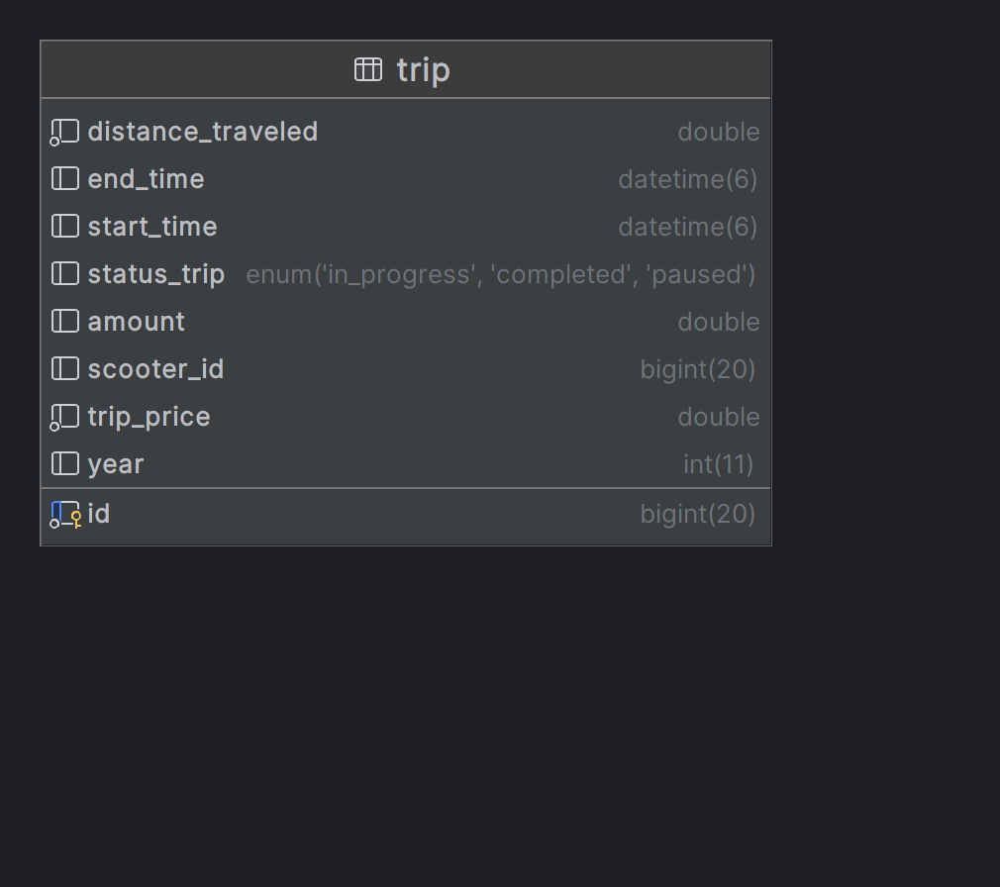
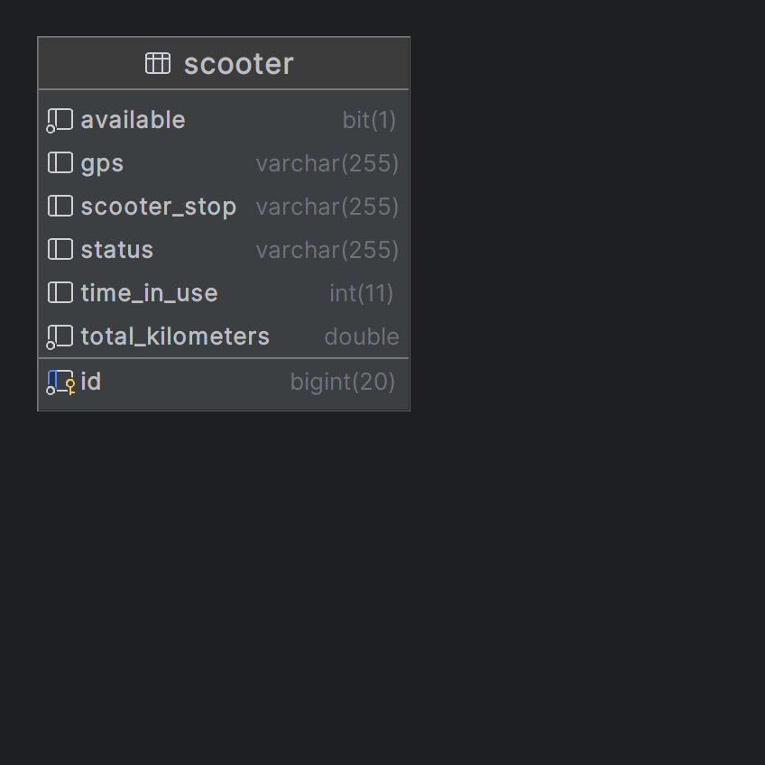
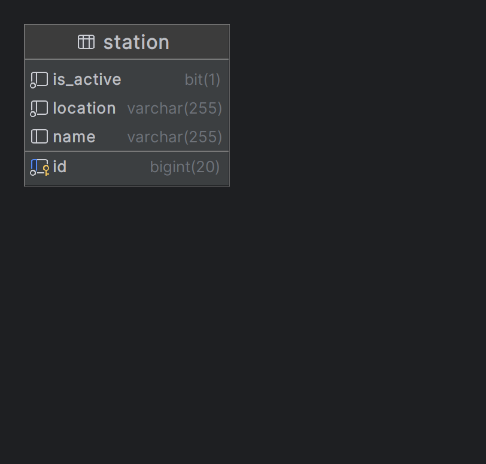
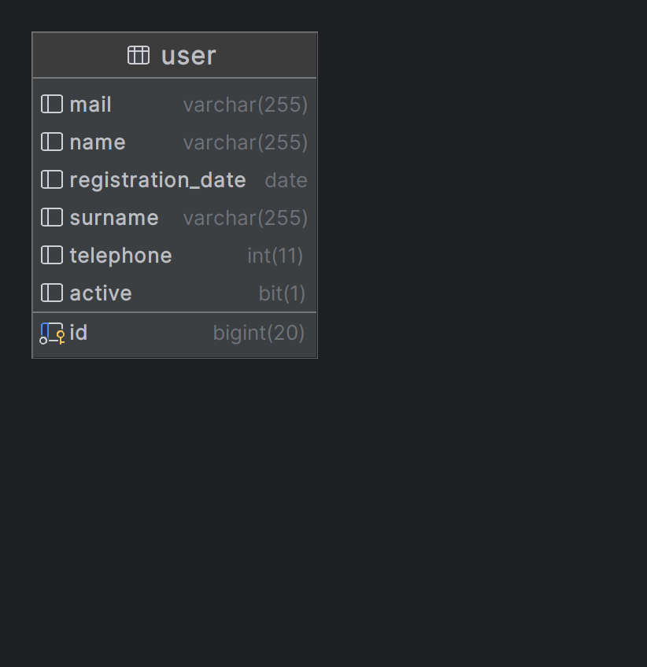
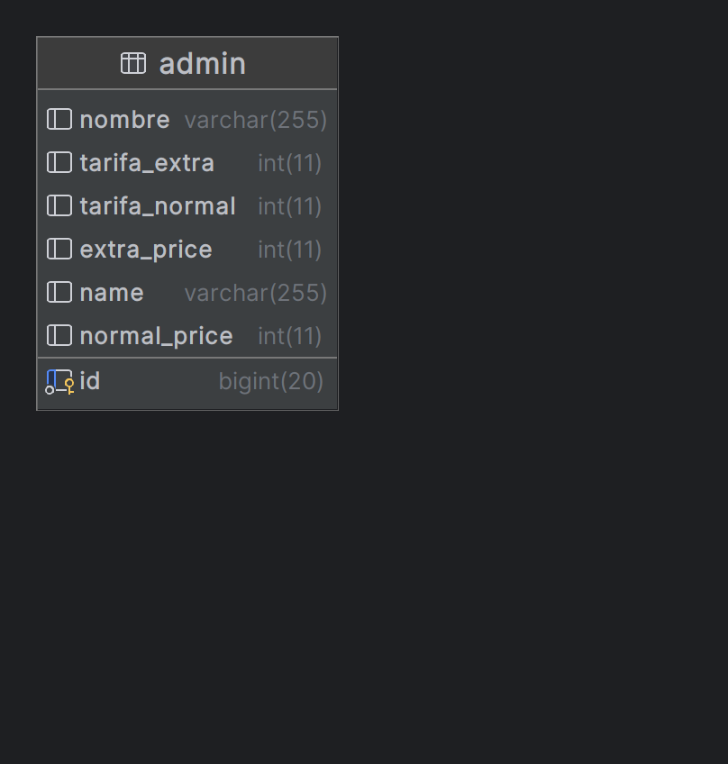

# Proyecto de Arquitectura de Microservicios para Scooters

Este proyecto está desarrollado en base a la arquitectura de microservicios, centrado en el alquiler y gestión de scooters.

## Descripción
Este repositorio contiene el código necesario para el despliegue y administración de microservicios de alquiler de scooters. Utilizamos herramientas modernas y prácticas recomendadas para garantizar escalabilidad y eficiencia en el sistema.

## Requisitos
- Docker
- Postman
- Java 11 o superior
- Maven

## Ejecución
Para ejecutar el proyecto, sigue estos pasos:

1. Clona el repositorio.
2. Configura el archivo .env con las variables de entorno necesarias.
3. Corre el siguiente comando en la terminal:
   ```bash
   docker-compose up -d
  Esto iniciará los servicios en contenedores, como la base de datos y cualquier otro microservicio que esté configurado en docker-compose.yml.
4. Una vez que Docker esté en funcionamiento, inicia la aplicación Spring Boot ejecutando: ./mvnw spring-boot:run o, si usas Maven instalado en tu sistema: mvn spring-boot:run.
5. Cada microservicio estara disponible en el puerto configurado en application.properties.

## Colección de Postman

Para probar los endpoints del sistema, puedes utilizar la colección de Postman que se encuentra en la siguiente ubicación dentro del proyecto:

src/main/resources/postman/Tpe Arquitectura Microservicios Scooters.postman_collection.json

Simplemente importa esta colección en Postman para acceder a todas las solicitudes preconfiguradas.

---

# Microservicios, entidades, endpoints

## TRIP

**Descripción:** La entidad `Trip` representa los viajes realizados con monopatines, permitiendo su creación, consulta, actualización y eliminación.



1. **Obtener todos los viajes**
   - **Ruta:** `http://localhost:8002/trips`
   - **Método HTTP:** `GET`

2. **Crear un viaje**
   - **Ruta:** `http://localhost:8002/trips/addTrip`
   - **Método HTTP:** `POST`
   - **Body:**
   {
       "startTime": "2024-11-03T10:00:00",
       "endTime": "2024-11-03T10:30:00",
       "distanceTraveled": 5.2,
       "statusTrip": "IN_PROGRESS"
   }

3. **Obtener un viaje**
   - **Ruta:** `http://localhost:8002/trips/{tripId}`
   - **Método HTTP:** `GET`

4. **Eliminar un viaje**
   - **Ruta:** `http://localhost:8002/trips/{tripId}`
   - **Método HTTP:** `DELETE`

## SCOOTER

**Descripción:** La entidad `Scooter` administra los monopatines, su disponibilidad y su estado de mantenimiento.



1. **Obtener todos los monopatines**
   - **Ruta:** `http://localhost:8001/scooters`
   - **Método HTTP:** `GET`

2. **Crear un monopatín**
   - **Ruta:** `http://localhost:8001/scooters/addScooter`
   - **Método HTTP:** `POST`
   - **Body:**
   {
      ACA PONER UN EJEMPLOOOOOOOOOOOOOOOOOOOOOOOOOOOOOOOOOOOOOOOO
   }

3. **Obtener un monopatín**
   - **Ruta:** `http://localhost:8001/scooters/{scooterId}`
   - **Método HTTP:** `GET`

4. **Obtener todos los monopatines disponibles**
   - **Ruta:** `http://localhost:8001/scooters/available`
   - **Método HTTP:** `GET`

5. **Eliminar un monopatín**
   - **Ruta:** `http://localhost:8001/scooters/{scooterId}`
   - **Método HTTP:** `DELETE`
  
6. **Registrar monopatín en mantenimiento**
   - **Ruta:** `http://localhost:8001/scooters/maintenance/{scooterId}`
   - **Método HTTP:** `PUT`
  
7. **Registrar fin de mantenimiento de monopatín**
   - **Ruta:** `http://localhost:8001/scooters/finishMaintenance/{scooterId}`
   - **Método HTTP:** `PUT`

8. **Ubicar monopatín en parada**
   - **Ruta:** `http://localhost:8001/scooters/stop/{scooterStop}`
   - **Método HTTP:** `PUT`

9. **Reporte de uso de monopatines por kilómetros**
   - **Ruta:** `http://localhost:8001/scooters/report/kilometers`
   - **Método HTTP:** `GET`

## STATION

**Descripción:** La entidad `Station` permite gestionar las estaciones donde se encuentran los monopatines.



1. **Obtener todos los admins**
   - **Ruta:** `http://localhost:8004/stations`
   - **Método HTTP:** `GET`

2. **Crear una estación**
   - **Ruta:** `http://localhost:8005/stations/addStation`
   - **Método HTTP:** `POST`
   - **Body:**
   { 
      ACA PONER UN EJEMPLOOOOOOOOOOOOOOOOOOOOOOOOOOOOOOOOOOOOOOOO
   }

3. **Obtener una estación**
   - **Ruta:** `http://localhost:8085/stations/{stationId}`
   - **Método HTTP:** `GET`

4. **Eliminar una estación**
   - **Ruta:** `http://localhost:8085/stations/{stationId}`
   - **Método HTTP:** `DELETE`
  
## USER

**Descripción:** La entidad `User` gestiona a los usuarios del servicio, incluyendo datos personales y el estado de su cuenta.



1. **Obtener todos los usuarios**
   - **Ruta:** `http://localhost:8003/users`
   - **Método HTTP:** `GET`

2. **Crear un usuario**
   - **Ruta:** `http://localhost:8003/users/addUser`
   - **Método HTTP:** `POST`
   - **Body:**
   {
       "id": 1,
       "name": "Juan",
       "surname": "Pérez",
       "mail": "juan.perez@example.com",
       "telephone": 123456789,
       "registrationDate": "2024-11-01"
   }

3. **Obtener un usuario**
   - **Ruta:** `http://localhost:8003/users/{userId}`
   - **Método HTTP:** `GET`

4. **Eliminar un usuario**
   - **Ruta:** `http://localhost:8003/users/{userId}`
   - **Método HTTP:** `DELETE`
  
//FALTA IMPLEMENTARRRRRRRRRRRRRRRRRRRRRRRRRRRRRRRRRRRRRRRRRRRRRRRRRRRRRRRRRRRRRRRRRRRRRRRRRRRRRRRRR

5. **Listado de monopatines cercanos a una ubicación**
   - **Ruta:** `http://localhost:8003/users/{userId}/scooters/nearby`
   - **Método HTTP:** `GET`

## ADMIN

**Descripción:** La entidad `Admin` permite gestionar la administración de los monopatines, usuarios y estaciones.



1. **Obtener todos los admins**
   - **Ruta:** `http://localhost:8004/admins`
   - **Método HTTP:** `GET`

2. **Crear un administrador**
   - **Ruta:** `http://localhost:8004/admins/addAdmin`
   - **Método HTTP:** `POST`
   - **Body:**
   { 
        "nombre": "Encargado",
        "tarifaNormal": 100,
        "tarifaExtra": 50
    }

3. **Obtener un administrador**
   - **Ruta:** `http://localhost:8004/admins/{adminId}`
   - **Método HTTP:** `GET`

4. **Eliminar un administrador**
   - **Ruta:** `http://localhost:8004/admins/{adminId}`
   - **Método HTTP:** `DELETE`

5. **Anular cuenta de usuario**
   - **Ruta:** `http://localhost:8004/admins/users/active/{userId}`
   - **Método HTTP:** `PUT`

//FALTA IMPLEMENTARRRRRRRRRRRRRRRRRRRRRRRRRRRRRRRRRRRRRRRRRRRRRRRRRRRRRRRRRRRRRRRRRRRRRRRRRRRRRRRRR

6. **Consultar monopatines con más de X viajes en un año**
   - **Ruta:** `http://localhost:8004/admins/scooters/trip/{tripsQuantity}/year/{year}`
   - **Método HTTP:** `GET`

//PROBAR (EL 2DO ANDA PERO EL PRIMERO PROBAR, SI ANDA QUEDARSE CON ESE)

7. **Consultar el total facturado en un rango de meses de un año específico**
   - **Ruta:** `http://localhost:8004/admins/trips/totalInvoiced?year={year}&month1={month1}&month2={month2}` O 
   - **Ruta:** `http://localhost:8002/trips/totalInvoiced?year={year}&month1={month1}&month2={month2}`
   - **Método HTTP:** `GET`

8. **Consultar la cantidad de monopatines en operación vs en mantenimiento**
   - **Ruta:** `http://localhost:8004/admins/scooters/quantity`
   - **Método HTTP:** `GET`

9. **Ajuste de precios**
   - **Ruta:** `http://localhost:8004/admins/pricing/{adminId}/{normalPrice}/{extraPrice}`
   - **Método HTTP:** `PUT`
   - **Body:** "2024-11-13"
